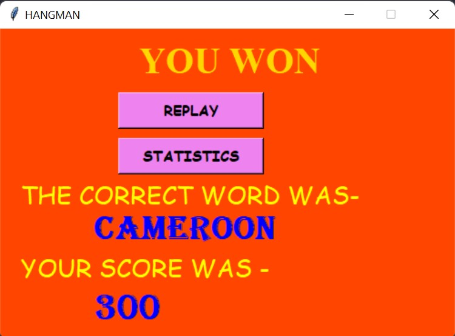
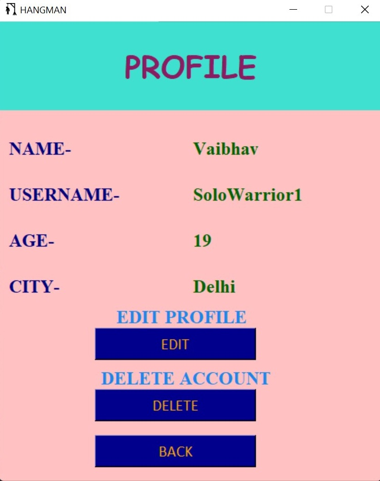

# Hangman

## Overview

This is the modified version of the famous Hangman game. I have built it completely on python using tkinter only.

## About

This is not just the simple game. It creates the account for the user and saves his/her progress. 
It can do the following:

* Creates an account for the user and provides signin option as well. 

        

* The player is welcomed and is given the opportunity to choose the category he wants to play in.
    
    

* This the game screen he plays the game on. 

    
  

* The profile, statistics as well as graph of recorded performance is also shown.

                 
  

* We can also edit our profile and in worst case delete our account.

* Shop is also underdevelopment wherein player would be able to buy background for the game

     

## Requirements

* Python 3 
* Various python libraries as mentioned in the requirements.txt